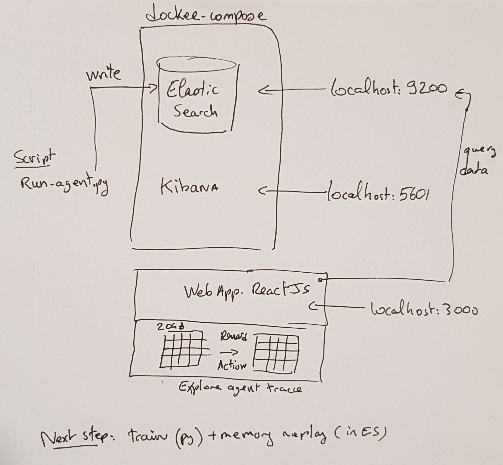

<h2 align="center">Py2048</h2>

<p align="center">
<a href="https://circleci.com/gh/AntoineToubhans/py2048"></a>
<a href="https://github.com/psf/black"></a>
</p>

Python implementation for the [2048](https://gabrielecirulli.github.io/2048/) tile game.

## Prerequisites

- python > 3.7
- docker


## Install

```
virtualenv venv -p python3.7
source venv/bin/activate
pip install -r requirements.txt
```


## Architecture




## Start project in local


Start elasticsearch and Kibana:
```
docker-compose up -d
```

## Code Quality

- run test: `pytest`
- run linter: `pylint src --ignore-patterns=test`
- format python code: `black .`


## Web App

Doc is [here](./webapp)


This project is licensed under the terms of the MIT license.
